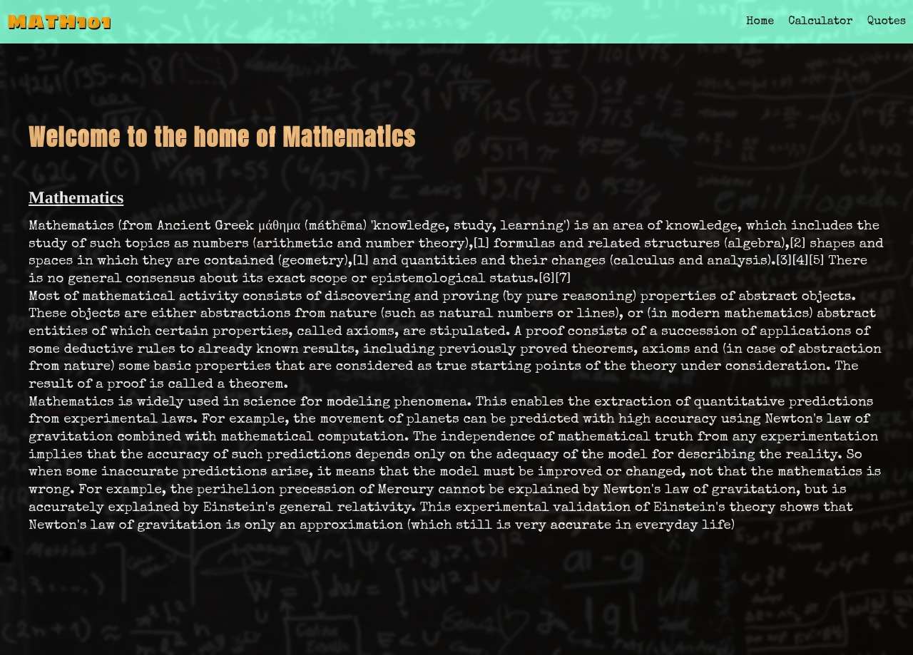

# Math-Magician 

Math Magicians is an SPA made for all fans of maths. It contains a calculator that allows the users to make the majority of arithmetic operations. In additions, it displays a random math related quote in each session. view the project [here](https://mathmagician101.herokuapp.com/)

 

- Make simple calculation
- Read A random Math-related quote
## Project List

- [x] Project 1: Setup
- [x] Project 2: Components
- [x] Project 3: Events
- [x] Project 4: Refactor with hooks(pair programming)
- [x] Project 5: Full website.
- [ ] Project 6: tests(pair programming)
- [x] deploy

## Built with
- React
- CSS3

## Getting Started
To get a local copy up and running follow the steps below

### 
- clone this repo by copy pasting this on your terminal ``git clone https://github.com/daudi13/math-magician.git``

- open the project folder 'cd math-magician'
- Run 'npm install' to install all dependencies
- Run 'npm start' to start the live server

## Author
**David Ouma**
- Github: [@daudi13](https://github.com/daudi13/)
- Twitter: [@davouma](https://github.com/daudi13/)

## Contributing
Contributions, issues, and feature requests are welcome!

Feel free to check the [issues page](https://github.com/daudi13/math-magician/issues)

## Show your Support
Give a star if you like this project!

## License
This project is under the [MIT](./LICENSE) license.
